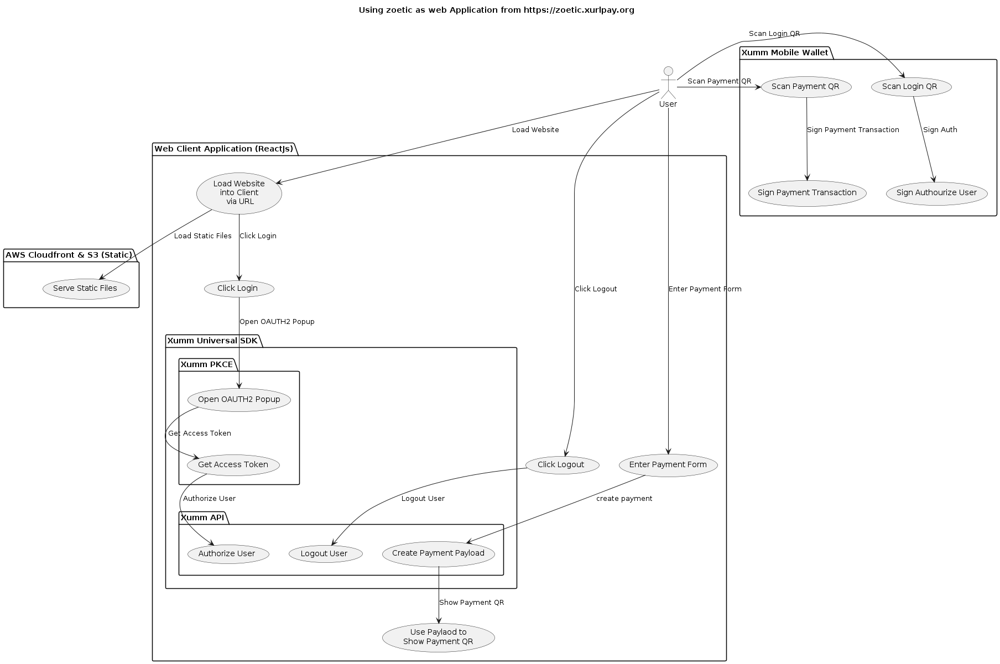

# zoetic-xumm
A proof of concept for a xumm app demonstrating the concept of "Hybrid xApps" which are xApps that have three authentication modes:

* xApp - xumm apps are authenticated by the using the application inside the xumm mobile app and the xumm API via the xAppToken generated by the xumm app.
* Browser OAuth2 - xApps can also be authenticated by the user via a browser based OAuth2 flow. This is the most common way to authenticate a web app.

The project includes all implementations required to run a xumm app, a browser based OAuth2 flow and a server side JWT backend. The project is a simple FastAPI app that can be run locally or deployed to a server. The app is a simple stub that can be used to build any new xapp, as a ReactJS app that can be built and deployed to a server or as a static site.


## Xumm API
The xumm platform allows developers and app users to "meet up". While app users can simply use the xumm app to track their accounts, balances and transactions, the true power of xumm is the platform made available to developers for their applications and their end users.

[Xumm-Universal-SDKT](https://github.com/XRPL-Labs/Xumm-Universal-SDK)

```javascript
/**
 * Scenarios:
 *   - xApp: apikey:        » Go ahead
 *   - xApp: apikey+secret:             » ERROR
 *   - xApp: jwt:           » Go ahead
 * »»» Load SDKJWT + XAPP (UI INTERACTION)
 *
 *   - Browser: apikey      » PKCE
 *   - Browser: api+secret              » ERROR
 *   - Browser: jwt:        » Go ahead
 * »»» Load SDKJWT
 *
 *   - CLI: apikey                      » ERROR
 *   - CLI: jwt             » Go ahead
 *   - CLI: apikey+secret   » Go ahead
 * »»» Load SDK
 */
```

There are some considerations when using ReactJS to write a xumm app. The xumm app is a ReactJS app that is embedded in the xumm app, but it can also run as an application on the web browser. This means that the app needs to be able to handle to manage the state of what kind of mode it is running in and provide different UX for each mode:


This means that state management needs to be aware of which mode the app is running in and handle the different scenarios.

* ott - xApp "One Time Token" - this is the token generated by the xumm app and is used to authenticate the xApp. This model is only available in the xumm app.

* openid - this is the OAuth JWT token header generated by the xumm SDK and is used to authenticate the browser based app. This model is only available in the browser PKCE flow.

The code to manage the state is in these places:

[App.js Management of App Type State](webapp/src/Header.js#L1)

```javascript
{ott && isXApp && <> {ott.nodetype} XAPP</>}
{openid && isWebApp && <> {openid.networkType} BROWSER</>}    
```

[XummAuthService.js](webapp/src/services/XummAuthService.js#L1)

* getXumm - returns the xumm SDK based by checking at local storage, usually used for the Browser mode. If no token is found, it will return a null, telling the app to login.
* setBearer (token) - sets the token in Axios for authorization to the backend.

### Global Xumm SDK and Promise Based SDK
If you are using ReactJS, you should use the global a `Xumm` instance to access the xumm SDK via a promise. This is the recommended way to access the xumm app because instantiating the SDK in the scope of the component can cause SDK sate issues.

```javascript
/**
 * IMPORTANT!
 * this is the Xumm SDK, its super important that you
 * you create this as a global top level reference.
 * Creating this within a component will cause the
 * component to re-render every time the state changes
 * and breaks the sdk
 */

const make = async () => {
    const xumm = await new Xumm(xummConfig.AppId)

    console.log("====== XUMM runtime", xumm.runtime);

    if (xumm.runtime.xapp) {
        console.log("XAPP");
        xumm.user.account.then(account => document.getElementById('account').innerText = account)
        xumm.xapp.on('destination', data => {
          console.log('A-xapp-destination@', data.destination?.name, data.destination?.address, data?.reason)
        })
        xumm.on('destination', data => {
          console.log('B-xapp-destination@', data.destination?.name, data.destination?.address, data?.reason)
        })
    }


    if (xumm.runtime.browser && !xumm.runtime.xapp) {
        console.log("WEBAPP");
        xumm.on("error", (error) => {
          console.log("error", error)
        })
        xumm.on("success", async () => {
          console.log('success', await xumm.user.account)
        })
        xumm.on("retrieved", async () => {
          console.log("Retrieved: from localStorage or mobile browser redirect", await xumm.user.account)
        })
      }

      return xumm;

};

const xumm = make();
```

The xumm SDK is a promise based SDK, so you need to use the `then` method to get the SDK.

```javascript
xumm.then((xummSDK) => {
    // do something with the xumm SDK
    xummSDK.environment.bearer?.then(r => {
        Axios.defaults.headers.common['Authorization'] = `Bearer ${r}`;
    });
})
```

### Managing Transactions
When a tx payload is created by the xumm SDK it generates a UUID that is used to manage the transaction lifecycle.

```json

{
	"uuid": "3f01e760-4c37-9b8b-e5f3e6a34417",
	"next": {
		"always": "https://xumm.app/sign/3f01e760-2130-4c37-e5f3e6a34417"
	},
	"refs": {
		"qr_png": "https://xumm.app/sign/3f01e760-2130-4c37-e5f3e6a34417_q.png",
		"qr_matrix": "https://xumm.app/sign/3f01e760-2130-4c37-e5f3e6a34417_q.json",
		"qr_uri_quality_opts": ["m", "q", "h"],
		"websocket_status": "wss://xumm.app/sign/3f01e760-2130-4c37-e5f3e6a34417"
	},
	"pushed": false
}
```

There are two ways to then sign transactions by the xumm app:

* Browser - the backend creates the payload and displays a QR code the user can scan a QR using xumm to sign.
* Broswer Mobile - The app is running on a mobile browser and the user can use the xumm app to sign the transaction.
* xApp - the xumm app uses the `xumm.xapp.openSignRequest({ uuid: '...' })` method to open the transaction in the xumm app.

## xApp Use Case

xApps are WebApps, embedded in XUMM for a great user experience. They add value (tooling, wizards) for end users, using Sign Requests and their Web UI to help users perform tasks on the XRPL and beyond.




#### xApp Signing
In the case of running as a xApp, since when xumm is a promise, we need to use the `then` method to get the response.

```javascript
xumm.then((xummSDK) => {
    xummSDK.xapp.openSignRequest({ uuid: res.data.uuid });
});    
```

## Browser Webapp Use Case


#### Broswer Mobile Signing
In this implementation the app identifies that it is running on a mobile browser 

```javascript
  useEffect(() => {
    if (/Mobi/.test(navigator.userAgent)) {
      setIsMobile(true);
    }
  }, []);

```

and then uses the `window.location` method to open the transaction in the xumm app.

```javascript
const handleMobileBrowserSign = async (uuid) => {
    if (isWebApp && isMobile) {
        window.location.href = `https://xumm.app/sign/${uuid}`;
    } 
};
```


